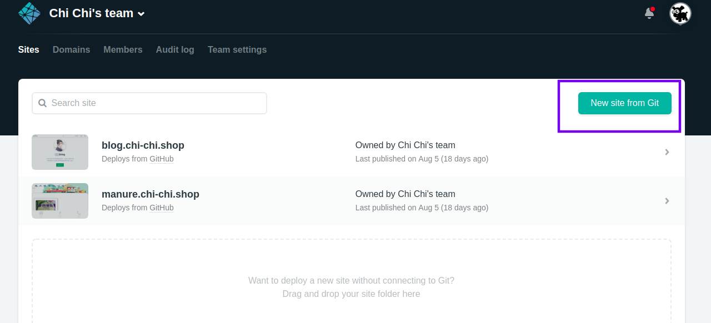

## 背景

一个同事也希望搭建一个差不多的blog系统，所以写这篇blog来记录下搭建的过程，这个建站几乎零成本，事先只要准备一个域名可以买也可以使用一些免费的二级域名，然后使用vscode，申请一个github账号就行了

## 第一步

### 代码配置

 1. 我使用的vuepresss，第一个对于vue比较熟悉，第二个就是vue的敢放文档挺好用的，所以使用这个来搭建。

 2. 由于使用原本的vuepress页面可能少些配置不满足美观以及需要的功能所以使用了一个主题来美化系统vuepress-theme-reco。
  
 3. 由于我使用的老版本现在新版本已经更新

    一、打开vscode 安装 markdownlint  
    二、在vscode中contrl + ` 然后使用按照下面的步骤进行输入命令
        ```
        # create
        npx vuepress-theme-reco-cli init my-blog
        # or
        npm install  -g
        reco-cli init my-blog

        # install
        cd my-blog
        npm install

        # run
        npm run dev

        # build
        npm run build
        ```
 4. 最简单按照上面执行后就可以看见页面了  
    
    上面的图就是配置首页展示的地方

 5. 后面的配置就是实现页面配置的地方
    
    ```js 
    module.exports = {
    title: '驰驰的blog',
    description: 'I am just a trespasser , only want to remain a trail of footprints for you',
    plugins: ['@vuepress/active-header-links','@vuepress/blog'],
    theme: 'reco',
    head: [
        ['meta', { name: 'viewport', content: 'width=device-width,initial-scale=1,user-scalable=no' }]
    ],
    themeConfig: {
        author: 'CHI-CHI',
        nav: [
        { text: '生活之旅', link: '/tags/', icon: 'reco-category' },
        { text: '技术之途', link: '/techonology/', icon: 'reco-up' },
        { text: '其他分类', 
            items: [
            { text: '见闻感悟', link: '/categories/frontEnd',icon: 'reco-message' },
            { text: 'contact', link: '/categories/backEnd',icon: 'reco-wechat' }
            ]
        },
        ]
    }
    }
    ```  
     
 6. 按照上面的配置配置好就可以有个基本框架了最后页面配置和目录结构 
 
下面是文章页面的头部配置

 ```
    ---
    title: vue + typescript 了解
    date: 2019-08-15 11:58:00
    tags:
    - vue
    - ts
    ---
 ```
  
### 域名购买
  
  我是在新网买的反正便宜10多块钱至少知道域名怎么配置
   
  注意我选择的配置等下就修改这些

### 静态网页服务商
  
  github也可以直接搭建但是嘛我们有greatefirewall所以还是[netlify](https://www.netlify.com/)这个服务商直接使用github账号创建一个用户
  选择新建网页
  
  选择github
  然后选择项目
  创建构建命令按照步骤走就是就不截图了
  之后配置域名和https
  
  以后gitpush一次就会构建一次，舒服
  
  完。。。。
### 参考文章

   [vuepress](https://vuepress.vuejs.org/)
   [vuepress-theme-reco](https://vuepress-theme-reco.recoluan.com/)
   [netlify](https://www.cnblogs.com/codernie/p/9062104.html)
