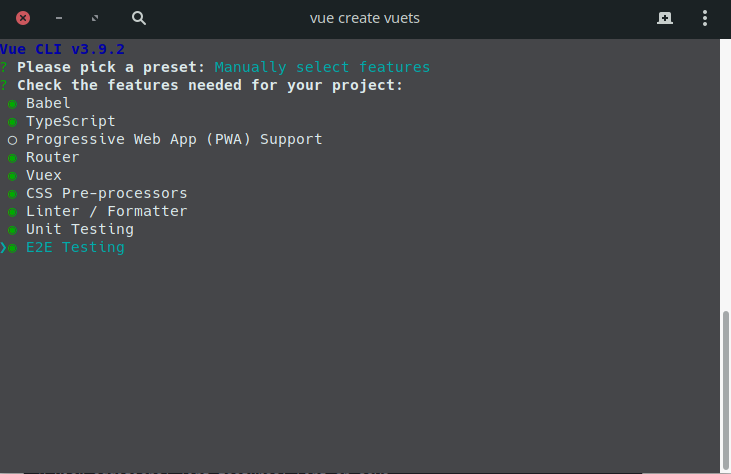

## 背景

vue3.0 更新在即，在学习部分 typescript 之后结合 vue 来搭建一个项目来练下手，学习新的开发方式。毕竟项目如果需要更加的可靠必须加上 type，以及一些面向对象，装饰器等来让项目更加工程化。

## 意义

1. 我认为随着前端工程化越来越多的厂商会注重，ts 的静态类型检查，增加项目的稳定性

2. vue 这块确实上手容易，但是结合 typescript 就感觉有些欠缺，不管是过往 api 还是各种 vue 插件都可能出现小问题。不建议正式环境使用。

3. 写这篇文章，意义在于，试试这个螃蟹怎么样。为后续开发做铺垫。

## 项目搭建

1. 打开终端 terminal 输入以下的命令

```shell

    # 1. 如果没有安装 Vue CLI 就先安装
    npm i -g @vue/cli

    # 2. 创建一个新工程，并选择 "Manually select features (手动选择特性)" 选项
    vue create vuets

    #如果出现下载时间过长建议使用nrm来解决
    # npm i -g nrm
    # nrm use taobao
    # 就可以了

```

2. 编辑器选择

- 当然选择宇宙最强 ide vscode 来编辑，它为 TypeScript 提供了极好的“开箱即用”支持。如果你正在使用单文件组件 (SFC), 可以安装提供 SFC 支持以及其他更多实用功能的 Vetur 插件。

## 项目配置

1. 创建项目

一、 这里使用 vue-cli，按照下面的选项进行项目的搭建和选择。

首先手动选择特性，然后依次选择下面的选项。



使用插件那种配置


启动项目

```shell

cd vuets

npm run start


```


然后添加 vuex 的装饰器

```shell

yarn add vuex-module-decorators

```

总结

这里使用了，一个测试端到端的测试工具，来实现前端页面的测试，问题就是会让整个项目下载非常慢，不是墙的问题，最好用流量开热点试试，反复 yarn or npm install 然后 merge 项目就可以完成了。
