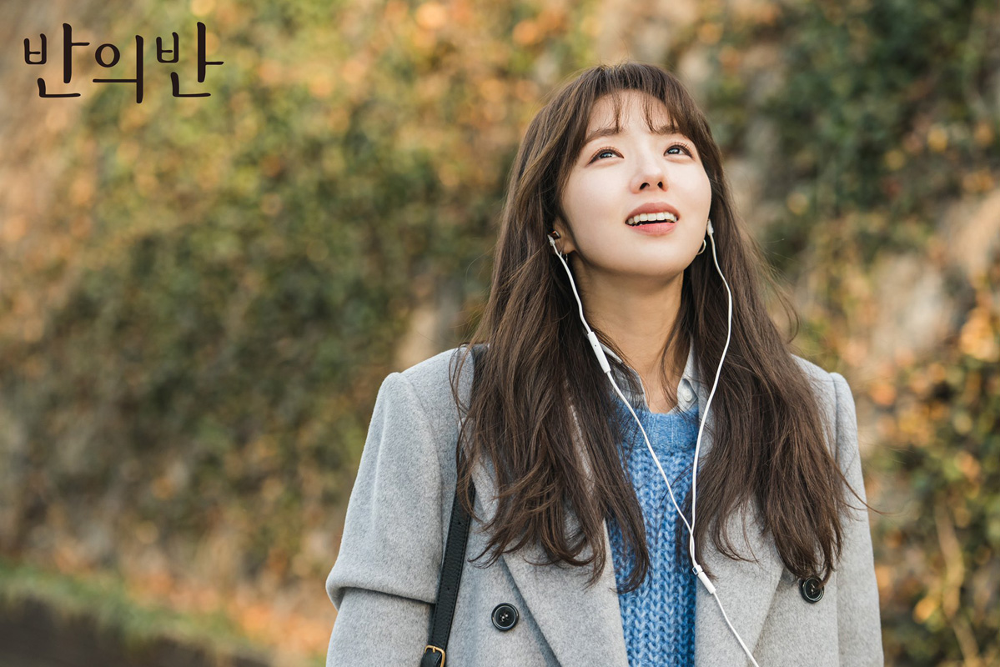

## 治愈剧 《半之半》《春夜》《耀眼》

新冠疫情别人四处游玩，不知道这波放开了，疫情是上涨还是会保持。如果这样都控制住了我觉得其实日常人流不密集的地方都可以不用带口罩了。不管对于中国的经济还是生产都是好事。特别对于第三产业是一个友好的信心。废话不多说了，主要是解读这三个剧以及一些体会。这三个剧都是治愈类型的剧情。可能看的剧比较多，目前对于这种朴实无华的剧比较感冒，而且也经历些岁月的洗礼，能够给这些剧情产生共鸣，人生除了像机器一样的活着或许感情这个东西才是能让人支撑走下去，以及留念岁月的残想了。一千个人眼里有一千个哈姆雷特希望我的感悟能激发不同的体会。

### 《半之半》

我只奢求你一半的一半就好了，给男主对暗恋对象如此一说。河元一个ai工程师，暗恋对象是小时候一起生活的挪威的深林中的智秀，但是当男主回归想和智秀在一起的时候智秀却要结婚了，于是男主时间停留冷冻像一颗冰块，但是时间是治愈人的最好的工具，聪明的他开发了一个神奇的工具这个工具可以通过声音和一切数据信息来分析构建出所对应人的人格和思想甚至是记忆，但是这个工具需要一个反映点，这个点是生成这个人最重要的信号（那个人最珍视的人的声音和信息），经过录音室的时候男主偶然发现了自己的ai出现了反应点于是买下了录音室，里面的人正是瑞雨女主。于是男主认为是瑞雨是激活自己的钥匙让这个工具和瑞雨相处可以得到更多的信息。通过ai的反应慢慢的女主和女二相互认识还成为了好朋友，不幸的是不久后女二死了男主和女二唯一能有联系的就是女二的ai，一个冰冷的机器能够代替一个逝去的人吗？剧中答案是给了否定答案，女主也是一个失去家人的人，和男主一样思想上都是受过伤痛和苦难的，女主让男主认清了现实放弃了那个空虚没有意义的依赖于ai生活的念想，遇到困难两个人拥抱给予慰藉。日常时把自己美好的清晨树林在窗岸的竹林的倒影分享给对方。路漫漫，能够遇到相互依偎走出时间的丛林，彼此互为拐杖的男主女主都是幸运的。女主也从他想在男主心中存在感的1%变成了100%。男主以为自己的反应点是智秀但是其实是在雷雨天保护自己的母亲（由于暴风雪听信了智秀丈夫男主将要回家而死智秀因此自责阴郁），女主的反应点是清晨先生男主，智秀反应点是丈夫。整部剧节奏舒缓，但是情感比较温情。大部分人都有烦恼和痛苦，甚至有些东西会痛不欲生的伴随一生，但是不要封闭自己，我觉得受伤的人应该和受伤的人很容易相互治愈，能够理解彼此的痛苦，在最脆弱时候给予你拥抱，当然，也要会自我治愈找寻生活中了细节和乐趣，清晨的一米阳光，竹子林的雨露，小动物的一丝运动都是沁人心脾的。

### 《春夜》

生活将我禁锢，但是你却解放了我。人物女主静仁是一个由于家里人的催促以及所谓的门当户对而和男二号在一起的被生活捆绑的人，志豪是一个单亲爸爸，生活无所追求没有欲望，只有满足但是崔儿子充满关怀，以及温暖周围的人。两个人遇见是药店的相识，彼此是都是正直的人，但相互遇到却变得懦弱，不敢打扰彼此生活，但是不甘于当前的生活的人。他们之间面临两个大山一个是女主对于男二只是刚刚合适但是不想结婚的状态（姐姐由于比较“听话”听了爸爸的安排，和一个看似体面但是却一点都不喜欢的人在一起后面甚至遭到家庭暴力，所以女主更加有阴阳）。男主的大山主要是有个连母亲都未见过面的儿子，导致男主生活的压抑，不得不承认，男主更加温柔细腻，充满魅力。拉扯点是男二十分优秀，富二代，也没啥大错，就是和女主在一起不怎么考虑别人的感受，自以为是。但是这个并不是错，女主也只是没有选择所以随着父母安排过着而以。当他们两个人遇见就是冰山的融化，生活充满了活力，虽然日后可能会更加艰难，但是有陪着自己翻山越岭的人一切都变得更加的轻松了。人只有那么一辈子，也许简简单单凑到一起，平平淡淡，不用相互理解也能过一辈子。但是比起现在选择更多的时代，能够遇到相认相知的人可能更是大多年轻人的想法把。毕竟有裂痕的下半辈子风险太高也不完美，感情没有对错。只是在合适的时间合适的地点遇到了合适的人。细水长流，物质和地位，在后半的幸福比起来可能真的一文不值，毕竟让你在自行车上笑的人也能让你在宝马里面笑，让你在宝马里面哭的人绝对会让你在自行车上哭。路选错了掉头还是有点吃力的。

### 《耀眼》

漆黑如夜的时间里，你是唯一的耀眼的光。这部剧是比较有意思的玄幻剧，开始十集讲述的是惠子有个手表可以穿越时空传送到以前的时间。上帝打开一扇门也不的给你机会跳窗。女主父亲出了车祸死去了，于是女主一次一次的穿越时空去拯救父亲。可怕的是父亲得救了但是却缺了一条腿，自己也成为了一个25岁的老太婆，她仰慕的少年因为父亲好赌弄得家徒四壁，自己的婆婆也跟着受累。经历这些后女主的开到让他能够接受这种生活，但是后面却加如老人一个老年俱乐部，在那个俱乐部就是为了卖补品骗钱的，然后每天给老年人举办活动。女主对男主这个行为嗤之以鼻，于是加入进去看看男主做了什么，男主在这里风声水起，除了通过他的温柔照顾还有一些积极的比如不满意就帮助推药这些很受老年人欢迎，受过伤的人总能够后受过伤的人相互感应，一个老婆婆想让男主为了她把药寄给抛弃他的儿子。然后男主感受到老婆婆对世界的失望以及留念的就只有儿子于是你请我原的骗了老人，最终还是告诉了老人。但是老人见了儿子以后就自杀了，这老人把保险受益人给了男主。但是男主的老大嫉妒谋划给所有老年人买保险然后制造意外来发大才，然后关了男主。女主就策划号召了老年人一起来帮助救出遭受毒打的男主。女主的时间手表在一次坏了之后被一个修表的偷了他也老了，但是女主每次去偷回来都没有成功。但是在最后救出男主之后那个老头把表归还，表掉在地上。转眼间回到了暴力革命时代，女主和男主你你情我爱的爱情追逐，也有了爱情的结晶。女主给男主一个金色的手表就是定情信物，不幸的是男主被当作革命分子给抓了，还被强了手表人也死了，女主发现了但是抢不回来，然后独自抚养儿子，儿子缺少父爱很叛逆，然后出了个车祸腿缺了。可以看到前面的梦幻其实是老年女主对于她人生的参念和遗憾，没能救出老公，没能保护好车祸的儿子。最后那个偷表的警官哭着还表但是女主不在需要了。因为他已经放下了，儿子也发现母亲为了他不摔倒扫了几十年的雪。也许我们到自己生命终结的时候也是对自己没有完成遗憾的事情朝思暮想的做梦，梦里的美好也许我们就心满意足，毕竟现实很可能无法改变了。这个故事虽然是讲述了在恶劣年代一个妇女的悲伤故事但是映射到我们也是同样的道理。我们每个人都有自己的遗憾以及伤感，这就是一场梦，有些时候学会放下，不只是对别人的宽恕也是对自己的解脱。

### 总结

这三部剧都是充满温情的故事，当然背后都饱尝辛酸。谁不是呢？不管你再顺风顺水的人生总是充满烦恼，时间也许不是万灵药，但是时间的流逝你可能会遇到治愈你的人，可能是情亲也可能是爱情，更甚至是两个能够相互添伤口的人。人生也要充满希望自我慰藉，路还长，走下去，走着走着路可能感觉就不会太曲折。当然要有机会选择正确的路途就勇敢把握机会，不然一地鸡毛的走着受伤的不只是自己，如果不幸尝试努力了也无法走出泥造就学会放下把，过好自己人身最后说不定就释然了。