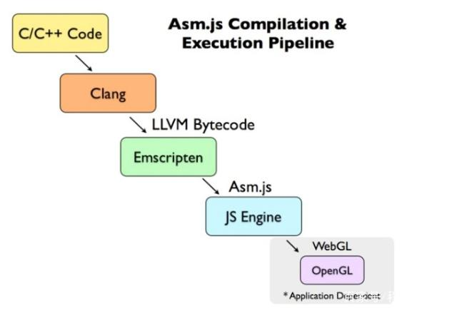
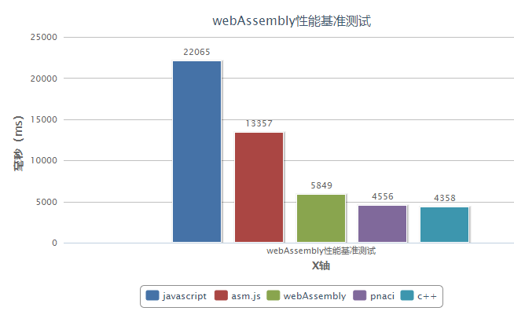

# WebAssembly

## javascript 发展弊端

一直以来web前端领域我们都是主要使用javascript语言来编写运行在浏览器的上面的web应用，随着vue，react等框架的出现，javascript语言正在变得越来越流行，直到成为github冠军，但是反观今天各种web应用，功能越来越复杂，性能要求越来越高，然而javascript的一些特性导致了它满足不了日益增长的需求。

## 快速发展与基准测试

从1997年开始ECMAScript作为正式草案提交给欧洲计算机制造协会让这个语言走向标准化，在这20年中javascript不管是语法还是引擎都出现翻天覆地的变化，前端在自动化工具和构建上面都出现了很大的发展。

语言特性上面是从2015年的es6发布之后出现了大的特性上面的改动。从此ECMAScript进入了快速发展促使javascript框架和前端架构体系逐渐成型和诞生。

而且在基于v8构建的Node.js引擎诞生后javascript力挽狂澜，能够在服务端，移动app还有桌面应用深度学习上面多个领域进行开发。

v8 的性能也在这些生态发展下日益提升，每天都有30~50个提交被合并到v8引擎上面。那么今天的的javascript的引擎性能提升有多大呢？

```jsx
// Version 85.0.4173.0 (Official Build) dev (64-bit)
(() => {
    let a = 6.123456, b = 2.718;
    let i, j;
    for(j = 0; j < 10 ; j++){
        const start = performance.now();
        for(i = 0;i < 100000000 ; i++) {
            a += b;
        }
        console.log(`${performance.now() - start} ms`)
    }
    console.log("a = " + a);
})()
```


```jsx
// v12.16.3
(function(){
    var a = 6.123456, b = 2.718;
    var i, j;
    for(j = 0; j < 10 ; j++){
        var start = new Date().getTime();
        for(i = 0;i < 100000000 ; i++) {
            a += b;
        }
        console.log(`${new Date().getTime() - start} ms`);
    }
    console.log("a = " + a);
})()
```

                                                                                                                                      


```java
// openjdk version "1.8.0_252"
public class Fuck {
    public static void main(String[] args) {
        double a = 6.123456;
        double b = 2.718;
        for(int i=0;i<10;i++){
            long startTime = System.currentTimeMillis(); 
            for(int j=0;j<100000000;j++){
                a += b;
            }
            long endTime = System.currentTimeMillis(); // 获取结束时间 
            System.out.println("程序运行时间： " + (endTime - startTime) + "ms");  
        }
        java.text.NumberFormat NF = java.text.NumberFormat.getInstance();
        NF.setMaximumFractionDigits(6);
        NF.setMinimumFractionDigits(0);
        NF.setGroupingUsed(false);
        System.out.println(NF.format(a));
    }
}
```


```rust
use std::time::Instant; // timer

fn main() {
    let mut a = 6.123456;
    let b = 2.718;
    for _x in 0..10 {
        let start = Instant::now();
        for _y in 0..100000000 {
            a += b;
        }
        println!("time cost: {:?} ms", start.elapsed().as_millis());// ms
    }
    println!("a= {:?} ms", a);
}
```


```python
import time 

def main():
    a = 6.123456
    b = 2.718
    for i in range(10):
        start = time.time()
        for j in range(100000000):
            a = a + b
        end = time.time()
        print("%f ms" % ((end - start)*1000))
    print("a = %f" % a)

if __name__ == "__main__":
    main()
```


上面我依次使用相同电脑 操作系统信息Linux gxc-pc 5.4.44-1-MANJARO #1 SMP PREEMPT Wed Jun 3 14:48:07 UTC 2020 x86_64 GNU/Linux 

- web: 225ms
- node : 225ms
- java: 71ms
- rust:70ms
- python:2690ms

其实通过javascript的解释器整个过程，就可以知道，为什么整个引擎处理在处理运算上话费很多流程的话就可以明白，主要是弱类型（week Type造成的），所有类型能够通过解释器进行判断。相对弱类型的编程语言就是强类型语言（strong Type ）编程语言。不需要使用额外的经历推断变量类型，从而提高代码效率，因此可以进行（AOT优化）直接生成二进制代码直接提供CPU执行，代码效率更高。

## 历史变迁 

* (不讲历史的技术都是耍流氓)
如果我们在javascript运行前便告知编译器的源代码的各种变量的具体类型同时保障这些类型不会在程序运行的时候发生改变，那么可以省略优化的过程，让整个运行效率获得更大的提升。

### 历史标杆（ASM.js）

这个技术适于2013年8月，它是javascript的严格子集，可以用于编译器的底层极，高效率的目标语言，为静态语言比如C++提供一个沙箱环境，用静态动态结合的方式优化AOT（Ahead-Of-Time，静态编译）的优化策略来验证，ASM.js的代码可以看看下面的列子.

```jsx
var asm = (function(stdlib, foreign, heap){
  'use asm';
   .....
		function __Z3addii($0,$1){
		   $0 = $0 | 0; // $0 变量申明为具体的整型
		   $1 = $1 | 0;
		   var $2 = (($1) + ($0)) | 0;
		   return ($2|0)
		}
    ......
    return {
			add: __Z3addii
		}
})(window.null,new ArrayBuffer(0x100000))
```

其中复制语句中 $0 = $0 | 0;强制把这个变量是做为32位的整数并且后面运行无法修改。



整个ASM.js 的生成流程，可以看到 ： C/C++ LLVM ==> LLVM IR Emscripten asm.js

解决思路是生成对自己和其他浏览器兼容的js代码

### 失败原因

应用场景少，各大浏览器对标准的实现不统一，使用成本高

### 历史革命者（NaCI && PNaCI）

这两个是google牵头的技术。

总的来看这个技术主要使用C++ 个javascript实现通讯来满足在高效率场景的需求 

NaCI ：每个平台会对应确定到二进制码，导致无法自由分发。

PNaCI：可以自由的在网络分发，作为中间吗的存在性能降低。


从上图来看这个技术就是有点向移动开发一样，通过消息传送来实现javascript和c++消息的传递来实现业务逻辑的改变

### 失败的原因

使用场景过于狭窄，高效的音频处理和视频处理高性能的计算在web场景以前不是那么多见。主要的原因是c++大大加大难度还有就是其他浏览器厂商不认可，导致兼容性低，会流失客户。

### 新的可能（webAssembly）

所有事物诞生都是有个经历的过程，之所以有webAssembly的产生都是源自于上面两个前辈的铺垫

1. 我画的垃圾图一张解释为啥性能牛逼（省略很多代码分析和优化）


2. 各大厂商的支持

我认为这个才是这个技术能够领先前辈的原因，很大程度上是因为w3c对于这个技术的标准统一导致这个技术对于程序员的可靠性，以及对于领导能够降低成本。既然都有95%以上的市场都支持这个技术有什么犹豫的呢？


3. 后续会增加Dom操作等等更多的特性

这个技术的出现不仅是web浏览器运行高性能的计算密集型应用成为可能，而且传统的web应用的性能问题可能wasm技术来解决。

    web平台

    - 图像视频编辑器
    - 在线游戏和网路游戏
    - 在线点对点应用
    - 在线流媒体
    - 在线图形识别
    - 虚拟现实AR
    - 在线编辑器，以及编译器等编程工具
    - 虚拟机以及模拟平台
    - 远程桌面应用
    - vpn应用
    - 加密服务

    非web平台

    - 跨端应用
    - 分发服务
    - 甚至类似dock一样的容器化技术

## 个人想法

因为javascript的动态语言特性，导致javascript很容易被反编译，而且该技术通过lvvm编译器来转化，也不可以轻易推断出使用的什么语言，所以认为

- 第一这个技术能够增加性能无可厚非，而且得益于使用静态语言开销小而且稳定
- 第二当客户使用用这个技术写的工具和仓库他很难对这个代码进行逆向分析
- 第三如果想做私人定制的功能只有给钱了。。。。。

### 一家人就要整整齐齐（性能测试）



## 项目搭建

### AssemblyScript

因为它与 JavaScript 非常相似，所以 AssemblyScript 使 Web 开发人员可以轻松地将 WebAssembly 整合到他们的网站中，而不必使用完全不同的语言。

社区亲儿子

```bash
mkdir AssemblyDemo
cd AssemblyDemo
npm init
// 使用npm安装加载程序
npm install --save @assemblyscript/loader
// 使用npm加载编译器
npm install --save-dev assemblyscript
// 安装后，编译器会提供一个方便的脚手架实用程序，以快速设置新的AssemblyScript项目，例如在刚刚初始化的节点模块的目录中
npx asinit .
// 编译成目标wat
npm run asbuild
```

虽然 AssemblyScript 起源参考Typscript 但是两者并不兼容

修改地址：/assembly/index.ts

```tsx
export function add():f64 {
  var a:f64 = 6.123456, b:f64 = 2.718;
  var i:i64 = 0, j:i64 = 0;
  for(i ;i < 100000000 ; i++) {
    a += b;
  }
  return a;
}
```

[基础类型](https://www.notion.so/e7e0ed21678b4d18bdd871d19490e884)

导出模块

```tsx
const fs = require("fs");
const loader = require("@assemblyscript/loader");
const imports = { /* imports go here */ };
const wasmModule = loader.instantiateSync(fs.readFileSync(__dirname + "/build/optimized.wasm"), imports);
module.exports = wasmModule.exports;
```

新增mian.js 文件

```tsx
export function add():f64 {
  var a:f64 = 6.123456, b:f64 = 2.718;
  var i:i64 = 0, j:i64 = 0;
  for(i ;i < 100000000 ; i++) {
    a += b;
  }
  return a;
}
```

```bash
node main.js
```


[AssemblyScript](https://www.assemblyscript.org/)

### Rust

没有难以预料的 GC 暂停，也没有 JIT 编译器造成性能抖动，只有底层控制与上层人体工程学的完美结合。代码尺寸越小，页面加载速度就越快。Rust 生成的 .wasm 模块不含类似于垃圾回收器这样的额外成本。高级优化和 Tree Shaking 优化可移除无用代码。

火狐亲儿子

### start

1. 安装rust以及标准库
2. cargo-generate：通过利用预先存在的git存储库作为模板，帮助您快速启动和运行新的Rust项目
3. wasm-pack：用于构建，测试和发布Rust生成的WebAssembly

```bash
cargo install cargo-generate
```

```bash
 wasm-pack: https://github.com/rustwasm/wasm-pack/releases/download/v0.9.1/wasm-pack-init.exe
```

搭建步骤

clone 模板

```bash
cargo generate --git https://github.com/rustwasm/wasm-pack-template
```

```bash
项目名称 wasm-game-of-life
编译打包 wasm-pack build
安装web程序 npm init wasm-app www
cd www 
修改pakeage.json
{
  // ...
  "dependencies": {
    "wasm-game-of-life": "file:../pkg", // Add this line!
    // ...
  }
}
下载依赖 npm install
启动项目 npm start
```

学习地址：

[WebAssembly](https://www.rust-lang.org/zh-CN/what/wasm)

[Rust and WebAssembly](https://rustwasm.github.io/docs/book/)