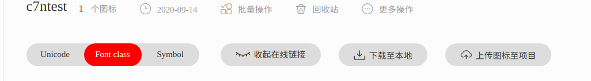
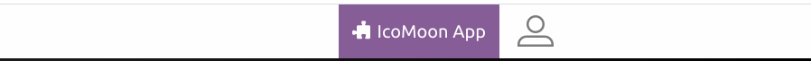
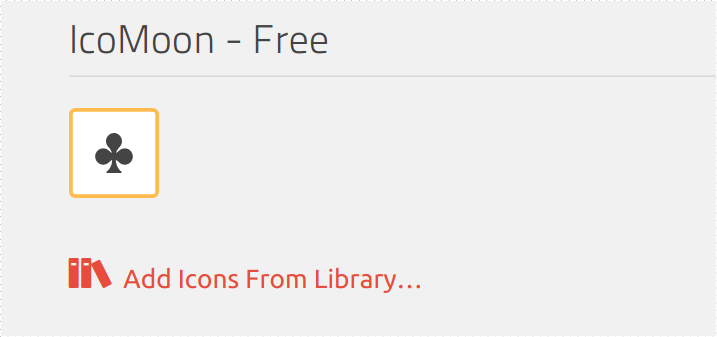
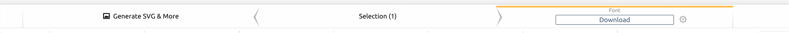
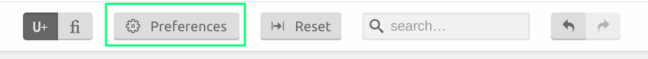
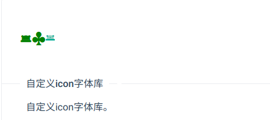

# choerodon-ui-icon

# 如何在 c7n-ui 中自定义图标

## 前言

我将会在下面几个小结来总结使用icon组件以及实现icon组件的方法，如果你仅仅需要知道怎么在你的前端工程使用自定义图标那就只需要阅读第一小结，下一节章节是介绍icon实现的方案以及发展,之后就是我为何要使用这种方法来处理icon组件。

## 一、在ui库中使用自定义图标功能

### 通过自定义字体库实现图标功能

好吧标题已经告诉你了目前组件库的整个图标实现就是基于字体来实现的，你看到的奇怪花样的图标它只是字体一样的存在所以你需要做的就是在项目入口处或者具体页面导入项目的字体文件而已，简单吧？下面介绍两种nb方法实现该方案，选择好对应方案后请仔细阅读对应方案，因为我认为对于这个功能实现从工程上来讲应该是约定大于功能，所以我才会写这篇文章。

### iconfont的使用

目前有不少制作字体图标的网站，比较火的有icomoon、阿里巴巴图标库 [http://www.iconfont.cn/help/platform.html](http://www.iconfont.cn/help/platform.html) 这个字体库支持导出字体文件和svg 我们先看看如何使用字体文件实现自定义图标

1. 进入我的管理找到我的项目
2. 点击添加按钮（那个文件样子的）
3. 好了规范来了 Font Familt 必须修改 hzero基础项目建议 hiam啊反正大概h×××这样的，其他外项目就可以按照项目cpic-hrms 这样的了只要保证与众不同就好了
4. 前缀改成icon-


5. 随便加一个帽子图标到购物车


6. 添加到项目


6. 下载到本地也可以生成在线的（如果可以访问外网确实可以减小打包体积）但是有网络不稳定风险还有如果是基础项目的话必须把文件地址留一份出来把？这里我直接下载



7. 把文件的iconfont.css引入到项目中

```bash
@font-face {font-family: "c7ntest";
  src: url('iconfont.eot?t=1600073880856'); /* IE9 */
  src: url('iconfont.eot?t=1600073880856#iefix') format('embedded-opentype'), /* IE6-IE8 */
  url('iconfont.woff?t=1600073880856') format('woff'),
  url('iconfont.ttf?t=1600073880856') format('truetype'), /* chrome, firefox, opera, Safari, Android, iOS 4.2+ */
  url('iconfont.svg?t=1600073880856#c7ntest') format('svg'); /* iOS 4.1- */
}

// 这里可以修改.c7ntest 弄成你想要的类名等下能用到

.c7ntest {
  font-family: "c7ntest" !important;
  font-size: 16px;
  font-style: normal;
  -webkit-font-smoothing: antialiased;
  -moz-osx-font-smoothing: grayscale;
}

.iconmaozi:before {
  content: "\e606";
}
```

8.展示demo和代码,其中customFontName就是你仓库名称type就是你要的icon 最开始的名称可以在iconfont里面看。


```css
import { Icon } from 'choerodon-ui';

ReactDOM.render(
  <>
    <Icon style={{color:'green'}} customFontName="c7ntest" type="maozi" />
  </>,
  mountNode);
```

### icomoon的字体生成

另外一个字体生成网站也是设计师用的比较多的[https://icomoon.io/](https://icomoon.io/)

1. 进入网页点击下面iconMoon APP



2. 选中需要导出的图标



3. 然后切换到导出字体



4. 配置字体参数字体名字一定要改，除了你想覆盖以前已经有的字体样式可以不用改




5. 下载后引入文件 下面就是代码

```css
@font-face {
  font-family: 'c7ntest1';
  src:
    url('fonts/c7ntest1.ttf?rnugw8') format('truetype'),
    url('fonts/c7ntest1.woff?rnugw8') format('woff'),
    url('fonts/c7ntest1.svg?rnugw8#c7ntest1') format('svg');
  font-weight: normal;
  font-style: normal;
  font-display: block;
}

.c7ntest1 {
  /* use !important to prevent issues with browser extensions that change fonts */
  font-family: 'c7ntest1' !important;
  speak: never;
  font-style: normal;
  font-weight: normal;
  font-variant: normal;
  text-transform: none;
  line-height: 1;

  /* Better Font Rendering =========== */
  -webkit-font-smoothing: antialiased;
  -moz-osx-font-smoothing: grayscale;
}

.icon-clubs:before {
  content: "\e918";
}
```

6. 测试浏览使用demo

刚刚我们选择的图标名字是 clubs


```jsx
import { Icon } from 'choerodon-ui';

ReactDOM.render(
  <>
    <Icon style={{color:'green'}} customFontName="c7ntest" type="maozi" />
    <Icon style={{color:'green'}} customFontName="c7ntest1" type="clubs" />
  </>,
  mountNode);
```

### 通过自定义svg实现图标功能

这个已经有一套好的ui方案了我就不用自定义写个，优点是兼容性还不错能够满足基本的ie11使用了而且还是彩色的。图标样式增加体验度10%，花里胡哨的颜色增加体验度100%。

1. 这个使用挺简单的首先步骤就参照我上面iconfont 走一遍
2. 这里我就用在线模式了也可以导出离线js文件


3. 引入npm @ant-design/icons 库

4. 自定义icon

```jsx
import { Icon } from 'choerodon-ui';
import { createFromIconfontCN } from '@ant-design/icons';

const MyIcon = createFromIconfontCN({
  scriptUrl: '//at.alicdn.com/t/font_2066932_6wpzydfnv8g.js', // 在 iconfont.cn 上生成
});

ReactDOM.render(
  <>
    <Icon style={{color:'green'}} customFontName="c7ntest" type="maozi" />
    <Icon style={{color:'green'}} customFontName="c7ntest1" type="clubs" />
    <MyIcon type="icon-maozi" />
  </>,
  mountNode);
```

5. demo 示例



```jsx
import { Icon } from 'choerodon-ui';
import { createFromIconfontCN } from '@ant-design/icons';

const MyIcon = createFromIconfontCN({
  scriptUrl: '//at.alicdn.com/t/font_2066932_6wpzydfnv8g.js', // 在 iconfont.cn 上生成
});

ReactDOM.render(
  <>
    <Icon style={{color:'green'}} customFontName="c7ntest" type="maozi" />
    <Icon style={{color:'green'}} customFontName="c7ntest1" type="clubs" />
    <MyIcon type="icon-maozi" />
  </>,
  mountNode);
```

## Icon技术简述

远古时期我们要用icon都是使用img直接加载的图片。当然多了就会出现请求过多的问题，如何解决这个问题是一个让人头大的事情。所以聪（苦）明（逼）的前端工程师提出了下面几种方案解决这个问题。

实现方式：

- image
- CSS Sprites
- Icon Font
- CSS Icon
- SVG（目前来看，是最完美的）

### 使用Image实现Icon

使用：

1. 设置height和width来控制大小 
2. vertical-align 等css 来控制居中这些

缺点：

1. 网络问题请求会过多消耗资源
2. 放大缩小图片容易变形

### 使用Css Sprites（Css精灵图）

这个方案就是弥补上一种请求过多导致的问题,加速的关键，不是降低质量，而是减少个数。


使用：

1. CSS Sprites其实就是把网页中一些背景图片整合到一张图片文件中，再利用CSS的“background-image”，“background- repeat”，“background-position”的组合进行背景定位，background-position可以用数字精确的定位出背景图片的位置。
2. .bg_sprite{background-image:url(/整图地址); background-repeat:no-repeat}

引用该类 .. 然后在元素中逐一定义背景坐标 .. 以下为关键属性 ..

#ico1 {width:容器宽度;height:容器高度;background-position:X坐标 Y坐标}

缺点：

1. ie6兼容性问题（不是问题，淘汰）
2. 难以维护，必须找到以前使用过的工具和图片，是一个风险项的存在

### font 库

后面发现其实字体也可以做成图片的样子弄成字体图标啊，这样就可以避免又臭又大的图片了，所以前端图标渐渐使用字体文件来实现图标，它里面规定了e918 这个对应的形状就长这个样。不但放大缩小不失真而且还可以设置想要的颜色。体验网址[iconfont](https://link.jianshu.com/?t=http://iconfont.cn/) 还有 [icomoon](https://icomoon.io/)

使用 ：

1. 建立字体文件，设置你新建立的字体名称以及对应的url 地址

```css
@font-face
{
font-family: myFirstFont;
src: url('×××.ttf'),
     url('×××.eot'); /* IE9 */
     font-weight: normal;
     font-style: normal;
     font-display: block;
}
```

2.  设置类名把刚刚确定的字体设置优先级最高

```css
.c7ntest1 {
  /* use !important to prevent issues with browser extensions that change fonts */
  font-family: 'myFirstFont' !important;
  speak: never;
  font-style: normal;
  font-weight: normal;
  font-variant: normal;
  text-transform: none;
  line-height: 1;
  /* Better Font Rendering =========== */
  -webkit-font-smoothing: antialiased;
  -moz-osx-font-smoothing: grayscale;
}
```

3. 定义类名使用的字体，利用伪类来实现对应样式的展现

```css
.icon-clubs:before {
  content: "\e918";
}
```

缺点：

1. 辣眼睛，想找个对应字体很麻烦，不利于理解含义 。（这个可以通过上面网址生成的demo来实现阅览，想全局替换图标很有效，替换方式相同字体名称，相同的类名替换对应字体码就行）。
2. 太朴素，如果UI是个前卫大胆的那么彩色风格可能是最佳选择

### CSS icon

这个简单粗暴 css 既然可以画方的也可以画圆的那么就可以直接把图标画出来。[cssicon](https://cssicon.space/#/)

缺点：

1.  IE支持不太好，比如border-radius IE8-不支持
2.  支持不丰富，ui 不能直接导出图片生成

### SVG

这个简单的说就是使用svg矢量图片来做icon，可以方便的修改 icon 的大小、颜色，缩放没有锯齿

- 支持多色图标了，不再受单色限制。
- 支持像字体那样通过font-size,color来调整样式。
- 支持 ie9+可利用CSS实现动画。
- 减少HTTP请求。
- 矢量，缩放不失真可以很精细的控制SVG图标的每一部分。

使用svg的好处就是你不用引入很多字体包文件库，指哪里打哪里。因为所有svg是可以内联到html里面的  下面就是个例子。

我直接封装成对应的组件直接使用就可以了。很香也很方便

```tsx
import * as React from 'react';

const ServerError = () => (
    <div>
        <svg width="400px" height="300px" viewBox="0 0 428 329" version="1.1" xmlns="http://www.w3.org/2000/svg" xmlnsXlink="http://www.w3.org/1999/xlink">
            <title>登录失效</title>
            <defs>
                <polygon id="path-1" points="0.522763676 0.467075819 61.1232757 0.467075819 61.1232757 95.2454467 0.522763676 95.2454467" />
                <linearGradient x1="53.2311238%" y1="93.4904814%" x2="53.2311238%" y2="0%" id="linearGradient-3">
                    <stop stopColor="#A1B7FE" stopOpacity="0.05" offset="0%" />
                    <stop stopColor="#A1B7FE" stopOpacity="0.6" offset="100%" />
                </linearGradient>
                <path d="M3.52807595,0.290056259 C1.80286369,0.290056259 0.389945237,1.73630098 0.389945237,3.50489451 L0.389945237,3.50489451 C0.389945237,5.27348805 1.80286369,6.72030942 3.52807595,6.72030942 L3.52807595,6.72030942 L424.197396,6.72030942 C425.923171,6.72030942 427.334964,5.27348805 427.334964,3.50489451 L427.334964,3.50489451 C427.334964,1.73630098 425.923171,0.290056259 424.197396,0.290056259 L424.197396,0.290056259" id="path-4" />
                <path d="M3.52807595,0.290056259 C1.80286369,0.290056259 0.389945237,1.73630098 0.389945237,3.50489451 L0.389945237,3.50489451 C0.389945237,5.27348805 1.80286369,6.72030942 3.52807595,6.72030942 L3.52807595,6.72030942 L424.197396,6.72030942 C425.923171,6.72030942 427.334964,5.27348805 427.334964,3.50489451 L427.334964,3.50489451 C427.334964,1.73630098 425.923171,0.290056259 424.197396,0.290056259 L424.197396,0.290056259 L3.52807595,0.290056259 Z" id="path-6" />
                <path d="M0.519128563,21.7034069 L0.519128563,38.7341576 L22.6270008,38.7341576 L22.6270008,26.6182573 C22.8100232,25.3740555 23.4709377,24.5145481 24.4803858,23.9366618 L24.4803858,23.9366618 L40.159876,23.9366618 L15.8427418,0.257964871 C7.21300611,4.68730056 1.62291225,11.5532215 0.519128563,21.7034069" id="path-8" />
                <path d="M54.8338724,40.9392068 C58.337849,42.5157214 59.5834186,45.4620407 59.8438302,49.0070863 L59.8438302,49.0070863 L61.0108809,49.0070863 L61.0108809,57.7525461 L82.8944941,57.7525461 L82.8944941,44.4420093 C81.7912753,33.3213578 72.3430225,28.2640072 60.1110204,25.2286956 L60.1110204,25.2286956 L54.8338724,40.9392068 Z" id="path-10" />
            </defs>
            <g id="页面-2" stroke="none" strokeWidth="1" fill="none" fillRule="evenodd">
                <g id="登录失效" transform="translate(-506.000000, -251.000000)">
                    <g id="编组-18" transform="translate(384.000000, 251.000000)">
                        <g id="登录失效" transform="translate(122.000000, 0.000000)">
                            <g id="编组-2" transform="translate(210.362869, 0.000000)">
                                <g id="编组" transform="translate(76.957427, 0.000000)">
                                    <mask id="mask-2" fill="white">
                                        <use xlinkHref="#path-1" />
                                    </mask>
                                    <g id="Clip-52" />
                                    <path d="M60.6014659,90.109305 C57.9123063,85.8430074 55.6038579,81.0853776 52.299487,77.1530279 C48.6543317,72.8162177 43.6927141,69.8789426 38.251974,68.4026897 C36.1589058,67.8340756 34.0056661,67.5164866 31.8462406,67.4408971 L31.8462406,0.466850179 L29.6688198,0.466850179 L29.6688198,67.445974 C25.8588959,67.60223 22.0815882,68.5143817 18.625945,70.1722752 C15.1584924,71.8363738 12.0593794,74.2298554 9.55748246,77.1558485 C6.75810217,80.4310202 4.82080504,84.3109085 2.52135425,87.9296179 C1.61034661,89.3635632 0.21009411,90.7202267 0.585181826,92.5631454 C0.900098051,94.1110392 2.28516709,95.2454467 3.85918586,95.2454467 L57.7807163,95.2454467 C60.4097045,95.2454467 62.0062172,92.3386331 60.6014659,90.109305" id="Fill-51" fill="#0E1D80" mask="url(#mask-2)" />
                                </g>
                                <polygon id="Stroke-53" fill="url(#linearGradient-3)" points="82.3365338 95.2457288 -7.95807864e-13 274.337152 212.915421 273.874589 131.971267 95.2457288" />
                            </g>
                        </g>
                    </g>
                </g>
            </g>
        </svg>
    </div>
);

export default ServerError;
```

贴几个张大佬的文章这样你也动怎么优化以及原理是啥

[svg技术](https://www.zhangxinxu.com/wordpress/2014/07/introduce-svg-sprite-technology/)

[svg体积优化](https://www.zhangxinxu.com/wordpress/2016/02/svg-compress-tool-svgo-experience/)

使用：

1. 参照上面模块第3个例子

缺点：

1. 兼容性ie9+

## C7N-ui的icon改造处理

由于整个文件库都是有很多用户，而且资源这些比如svg图片这些也不好找，所以这边我肯定无法直接使用上面看似最牛逼的svg大法从整个框架层面修改。但是没关系，我们同样可以享受自定义svg Icon 库 方案参看第一小结第三种。如果这个ant的库无法满足这个需求可以到，[燕千云](https://www.cloopm.com.cn/index-cn)给我提需求我可以改造成符合需要的使用逻辑的api。

### 原始处理方案

好了为了实现现在的兼容我如何处理这个问题，首先按照目前ui库的规则 我查看icon类名

```tsx
<i class="icon icon-4k-o"></i>
```

icon 标记使用的类名以及icon样式 icon-  4k-o  可以观察到 4-ko 目标关键字 那么 icon- 就是前缀 这样就可以确定指定的类名渲染指定的字体。所以前面有个全局配置有人在哪里改 icon 其实是有问题的因为字体库还是那个字体库你需要修改字体库的前缀才可以。

### 改造方案

我只需要关注下面几个问题：

- 怎么修改字体优先级使用
- 怎么让用户随意使用那个图标
- 怎么处理多项目之间的字体冲突
- 怎么创建字体文件

1和2的问题是代码问题

3是规范问题

4是工具问题

首先1和2 问题

我们需要指定使用的字体的为目标字体文件优先级最高

```tsx
export interface IconProps {
  type: string;
  className?: string;
  title?: string;
  customFontName?: string;
  onClick?: MouseEventHandler<any>;
  onFocus?: FocusEventHandler<any>;
  onMouseDown?: MouseEventHandler<any>;
  onMouseUp?: MouseEventHandler<any>;
  onMouseLeave?: MouseEventHandler<any>;
  style?: CSSProperties;
  tabIndex?: number; 
}

const Icon = function Icon(props: IconProps) {
  const iconfontPrefix = getConfig('iconfontPrefix');
  const { type, customFontName, className = '', ...otherProps } = props;
  const classString = classNames(iconfontPrefix, customFontName, `${iconfontPrefix}-${type}`, className);
  return <i {...otherProps} className={classString} />;
};
```

这里代码里面我增加了customFontname 属性 可以看到上面我约定的字体css，所以这里指定的类名font-family: 'myFirstFont' !important; 强制指定了这个classname ‘myFirstFont’字体库为优先最高 那么他会优先在这个字体库中找对应的字体文件。

```css
.c7ntest1 {
  /* use !important to prevent issues with browser extensions that change fonts */
  font-family: 'myFirstFont' !important;
  speak: never;
  font-style: normal;
  font-weight: normal;
  font-variant: normal;
  text-transform: none;
  line-height: 1;
  /* Better Font Rendering =========== */
  -webkit-font-smoothing: antialiased;
  -moz-osx-font-smoothing: grayscale;
}
```

2 规范问题

约定的话就是每个项目的c7ntest1 字体域要不一样。我建议上面也有写内部项目如果能共享字体文件就不多说如果不能，使用h×××font 这种然后font-family也是h×××font 当然如果项目本身没用多少图标建议使用svg方案。

3. 工具的话肯定是iconfont首先推荐了。国外的还是算了吧，仅仅当作备用方案，如果有本地自带转化工具加下css文件就行了问题不大。

## 总结

还是那句话没有最好的方案只有合适的。该文章从实现和原理简介，以及ui库出发给出了方案。如果你仅仅使用几个图标而已就别用字体库了。自己像我上面封装个svg它不香么，如果要做以前的字体覆盖那么你不能用svg方案了必须用font方法。比如你只为了一个log  它不cool么。完。。。