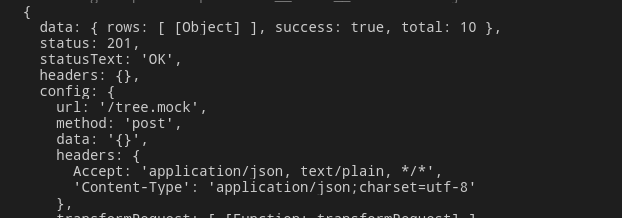

# xhr-mock

作为mock 请求非常有效

对于测试和原型设计十分有效，特别是后台还在编写的时候

可以在node 环境和浏览器环境运行. 能够兼容 **[Axios](https://www.npmjs.com/package/axios)**, **[jQuery](https://www.npmjs.com/package/jquery)**, **[Superagent](https://www.npmjs.com/package/superagent)甚至其他的库只要是按照**`XMLHttpRequest`标准 构建的，都没有问题.  

安装方法

    yarn add --dev xhr-mock

使用的话webpack可以直接import 浏览器环境

    import mock from 'xhr-mock';
    

使用列子：

我们比较常用的http请求处理使用的axios 也可以满足使用socket等

下面就是一个简单的列子

    // mock文件
    import mock from 'xhr-mock';
    
    const mockTempleList = [{
    data:{
    		rows: [
    		    {
    		      expand: false,
    		      functionCode: 'HR',
    		      icon: 'fa fa-cubes',
    		      id: 2,
    		      ischecked: null,
    		      score: 10,
    		      shortcutId: null,
    		      text: '组织架构',
    		      url: null,
    		      symbol: '0',
    		      parentId: 125,
    		    },
    		  ],
    		  success: true,
    		  total: 10,
    		},
    rule:/\/tree.mock/
    }]
    
    export function setup() {
      mock.setup();
      if (mockTempleList.length >= 1) {
        mockTempleList.map((item) => {
          const { rule, data } = item;
          mock.post(rule, {
            status: 201,
            body: JSON.stringify(data),
          });
        });
      }
    }
    
    export const teardown = mock.teardown.bind(mock);

然后建立一个测试文件

    import { setup, teardown } from './mock';
    
    describe('axios test ', () => {
      beforeEach(() => {
        setup();
        jest.useFakeTimers();
      });
    
      afterEach(() => {
        teardown();
        jest.useRealTimers();
      });
    
      it('should input value is equal to one', () => {
        const { wrapper } = setupByMount();
        axios
          .post('/tree.mock', {})
          .then(res => {
            console.log(res);
          })
          .catch(err => {
            console.log(err);
          });
        jest.advanceTimersByTime(4000);
        wrapper.update();
        wrapper.find('.c7n-tree-node-content-wrapper').simulate('click');
        expect(wrapper.find('NumberField').prop('value')).toBe(1);
        expect(wrapper).toMatchSnapshot();
      });
    });

然后运行测试这里可以看出是可以被拦截的

### api详解

### **.setup()**

替换全局的 `XMLHttpRequest` 的对象变成 `MockXMLHttpRequest`.

### **.teardown()**

重新恢复 `XMLHttpRequest` 对象到初始的状态.

### **.reset()**

移除所有的请求程序

### **.get(url | regex, mock)**

创建一个get请求要求一个url的正则表达式一个mock数据

mock.get(/\.*****.json**$**/, { body**:** JSON.stringify({ data**:** { id**:** "abc" } })});

### **.post(url | regex, mock)**

建立一个post请求

### **.put(url | regex, mock)**

注册一个put请求

### **.patch(url | regex, mock)**

注册一个patch 请求

### **.delete(url | regex, mock)**

注册一个delete 的请求

### **.use(method, url | regex, mock)**

注册一个请求拦截所有对相应的url

### **.use(fn)**

注册一个方法给所有的请求响应

### **.error(fn)**

抛出异常的钩子响应

## **MockXMLHttpRequest**

### **.method() : string**

获取请求信息的方法

### **.url() : MockURL**

获取请求url

### **.header(name : string, value: string)**

设置请求头

### **.header(name : string) : string | null**

获取请求头

### **.headers() : object**

获取所有的头部信息

### **.headers(headers : object)**

设置请求的头部信息

### **.body() : string**

获取请求的body

### **.body(body : string)**

社会子请求的body

### **MockResponse**

### **.status() : number**

获取请求状态

### **.status(code : number)**

设置请求状态

### **.reason() : string**

获取响应原因

### **.reason(phrase : string)**

设置响应原因

### **.header(name : string, value: string)**

设置响应头部

### **.header(name : string) : string | null**

获取一个响应头部

### **.headers() : object**

获取所有的响应头部

### **.headers(headers : object)**

设置所有响应头部

### **.body() : string**

获取响应body

### **.body(body : string)**

设置响应body

下面列出一些特殊的使用

Upload progress

    import mock from 'xhr-mock';
     
    mock.setup();
     
    mock.post('/', {});
     
    const xhr = new XMLHttpRequest();
    xhr.upload.onprogress = event => console.log(event.loaded, event.total);
    xhr.open('POST', '/');
    xhr.setRequestHeader('Content-Length', '12');
    xhr.send('Hello World!');
    

Download progress

    import mock from 'xhr-mock';
     
    mock.setup();
     
    mock.get('/', {
      headers: {'Content-Length': '12'},
      body: 'Hello World!'
    });
     
    const xhr = new XMLHttpRequest();
    xhr.onprogress = event => console.log(event.loaded, event.total);
    xhr.open('GET', '/');
    xhr.send();

### 项目处理

由于无法在项目中使用mockjs 进行拦截测试所以采用这个框架拦截请求然后使用mockjs生成mock数据。这样不但不会影响整个项目的原方式mock也可以满足策测试需要