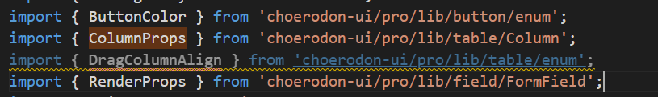

# 类型导出和枚举导出

## 开篇

组件库在项目上使用过程中有些项目使用typescript进行开发，但是发现会需要在大量文件中进行类型申明和导出。这样会导致头部引用量巨大问题，不利于项目后期维护，而且代码十分丑陋。如下：
    

### 解决方案

#### 方案一、
* 每个组件一个 interface.tsx(存放 props interface enum type)

 1. 多个组件引用使用会应用多个，便于维护，（首选符合直觉）主要改pro优先（收益大）基础慢慢来。

#### 方案二·
* pro 一个大文件基础一个大文件 interface.tsx

 1.  方便引用 ，难以维护

#### 方案三、
* 所有一个大文件用组件方式导出

 2.  方便引用 ，难以维护

### 结果

第一方案

```js
// 优化前
import { ButtonProps } from 'choerodon-ui/pro/lib/button';
import { ButtonColor} from 'choerodon-ui/pro/lib/button/eunm';

// 优化后
import { ButtonColor,ButtonProps } from 'choerodon-ui/pro/lib/button/interface';

```


其他两种方案

1. tsc 生成定义文件 
2. 通过文件合并操作让所有的文件合并成一个定义文件
3. 引入文件

导致问题： 由于不属于同源文件，导致组件依然类型报错
[生成类型库](https://www.npmjs.com/package/npm-dts)

最终还是采用了第一种稍微麻烦一点的方法

### 总结

在对组件库系统改造中尝试了好几种方法探索增加开发效率的办法来方便使用typescript的类型校验功能来让项目更加的健壮。还发现了枚举类型使用const声明虽然可以增加一定的性能优化但是无法在外部项目引用自动关联给vscode来使用。这也是一些小细节，所以在构建基层库的时候一定要优先考虑类型系统导出等问题来提升健壮性和开发效率。